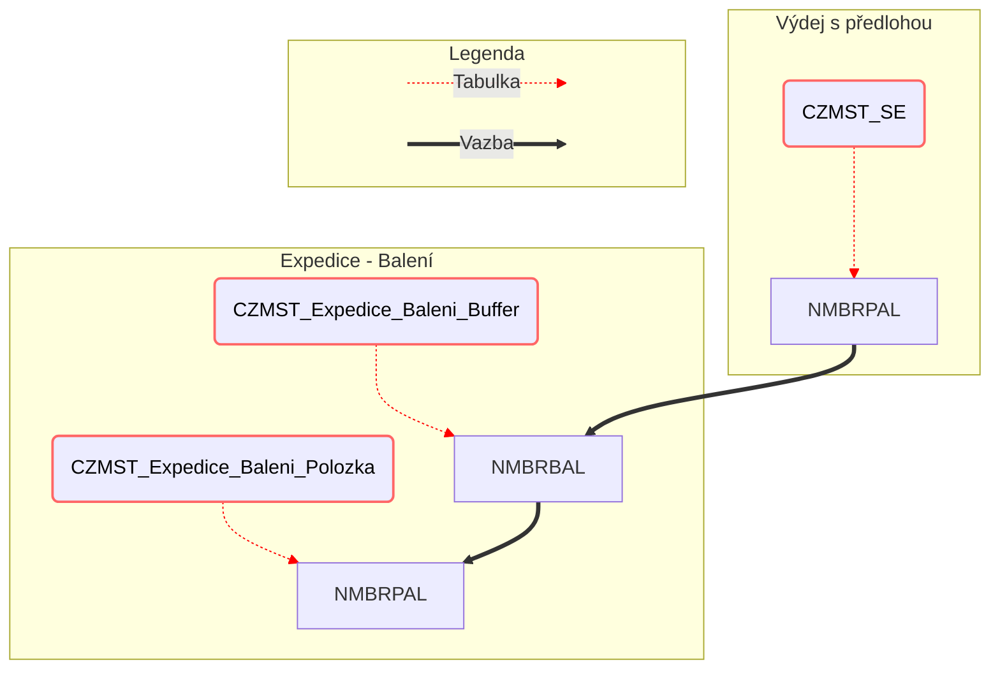

# I-Tec popis logiky balíku a palet #

* bla bla bla

```mermaid

flowchart TB

X(CZMST_SE)
Y(CZMST_Expedice_Baleni_Buffer)
Z(CZMST_Expedice_Baleni_Polozka)

A[NMBRPAL]
B[NMBRBAL]
C[NMBRPAL]


subgraph Výdej s předlohou
X -.-> A
end

subgraph Expedice - Balení
Y -.-> B
Z -.-> C
end


A ==> B ==> C 

style X stroke:#f66,stroke-width:2px,color:#000
style Y stroke:#f66,stroke-width:2px,color:#000
style Z stroke:#f66,stroke-width:2px,color:#000

subgraph Legenda
direction LR
start1[ ] -.->|Tabulka| stop1[ ]
style start1 height:0px;
style stop1 height:0px;
start2[ ] ==>|Vazba| stop2[ ]
style start2 height:0px;
style stop2 height:0px; 
end

linkStyle 0 stroke:red;
linkStyle 1 stroke:red;
linkStyle 2 stroke:red;

linkStyle 5 stroke:red;

```
