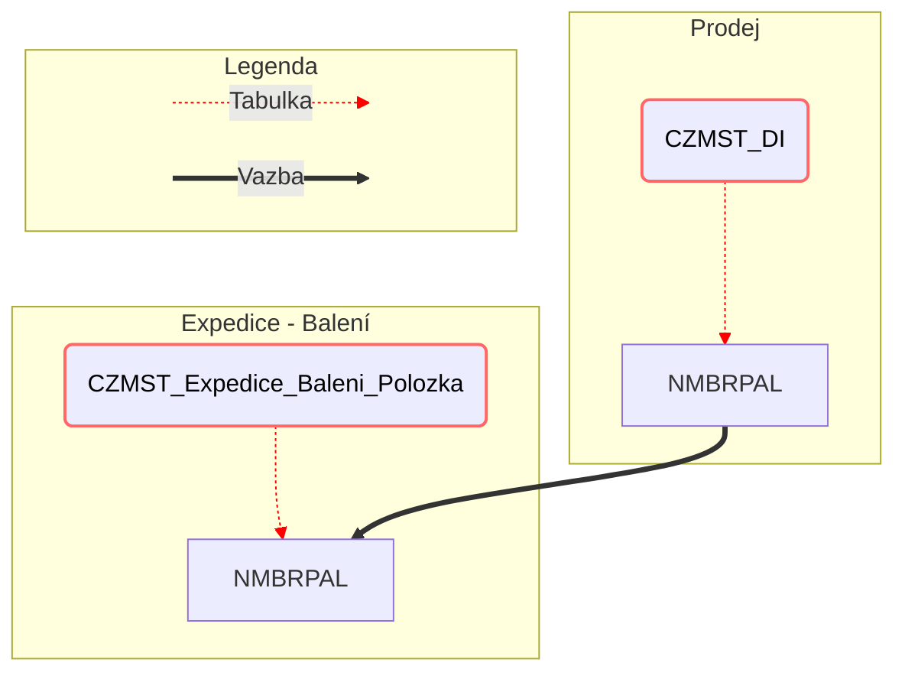

# Steinex popis logiky balíku a palet #

* bla bla bla

```mermaid

flowchart TB

X(CZMST_DI)
Z(CZMST_Expedice_Baleni_Polozka)

A[NMBRPAL]
C[NMBRPAL]


subgraph Prodej 
X -.-> A
end

subgraph Expedice - Balení
Z -.-> C
end

A ==> C 

style X stroke:#f66,stroke-width:2px,color:#000
style Z stroke:#f66,stroke-width:2px,color:#000

subgraph Legenda
direction LR
start1[ ] -.->|Tabulka| stop1[ ]
style start1 height:0px;
style stop1 height:0px;
start2[ ] ==>|Vazba| stop2[ ]
style start2 height:0px;
style stop2 height:0px; 
end

linkStyle 0 stroke:red;
linkStyle 1 stroke:red;
linkStyle 3 stroke:red;


```
